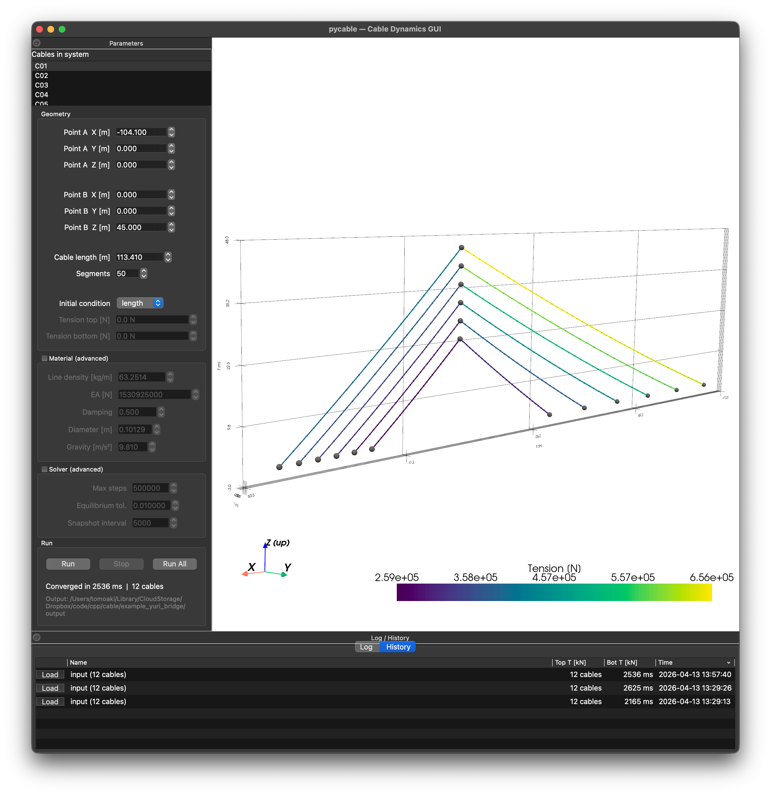

# Cable Dynamics — ケーブル動力学ソルバ

集中質量（Lumped Mass）モデルによるケーブル動力学 C++ ソルバと Python GUI．
係留索解析，斜張橋ケーブル，BEM 浮体連成に対応．



*斜張橋 12 本のケーブルを一括解析し，共通テンションカラーマップで表示した例．*

## 特徴

- **集中質量ケーブルモデル** (`LumpedCable`) — RK4 時間積分，ケーブルごとの CFL 時間刻み
- **複数の入力形式** — per-cable JSON（推奨），settings.json（複数ケーブル一括），BEM 互換 13 要素配列，レガシー単一ライン
- **初期条件の選択** — 自然長を直接指定，または目標張力を指定して自然長を反復収束（secant method）
- **動的モード** — 端点に正弦波強制運動を与え，ケーブルの時間応答を解く（CFL サブステップ自動分割）
- **Python GUI** (`pycable`) — PySide6 + PyVista 製
  - Run All ボタン（全ケーブルの張力を共通カラースケールで表示）
  - 実行履歴（History）の永続保存と結果の再読み込み
  - 最近開いたファイル（Recent Files）メニュー
  - 初期条件 UI（自然長 / 張力の切替）
- **BEM 連成** — `LumpedCableSystem` が BEM 時間領域ソルバと `advanceRKStage` / `commitRKStep` / `forceOnBody` で連携

## セットアップ

Mac / Linux / Windows のプラットフォーム別インストール手順は **[INSTALL.md](INSTALL.md)** を参照．

**Quick Start（Mac）:**

```bash
git clone https://github.com/tomoakihirakawa/CableDynamics.git
cd CableDynamics
mkdir -p cable/build_solver && cd cable/build_solver
cmake -DCMAKE_BUILD_TYPE=Release -DSOURCE_FILE=cable/cable_solver.cpp ../..
make -j$(sysctl -n hw.logicalcpu)
cd ../..
cable/build_solver/cable_solver cable/gui/examples/catenary_500m.json /tmp/cable_test
```

## 使い方

### 単体ケーブル（per-cable JSON）

```bash
./cable_solver C01.json output/
```

**C01.json** の例:
```json
{
  "name": "C01",
  "end_a_position": [-104.1, 0.0, 0.0],
  "end_b_position": [0.0, 0.0, 45.0],
  "cable_length": 113.41,
  "n_points": 31,
  "line_density": 63.2514,
  "EA": 1530925000.0,
  "damping": 0.5,
  "diameter": 0.10129,
  "gravity": 9.81,
  "mode": "equilibrium"
}
```

結果: `output/C01_result.json`（節点座標，張力分布，収束状態）

### 複数ケーブル（settings.json）

```bash
./cable_solver settings.json output/
```

**settings.json** の例:
```json
{
  "input_files": ["cables/C01.json", "cables/C02.json", "cables/C12.json"],
  "output_directory": "./output",
  "gravity": 9.81,
  "mode": "equilibrium",
  "max_equilibrium_steps": 500000
}
```

各ケーブルが独立に解かれ，`output/C01_result.json`, `output/C02_result.json`, ... が生成される．

### 張力指定の初期条件

ケーブル解析では自然長（無応力長）$L_0$ が入力として必要だが，実橋の施工記録や FEM 解析結果からは**張力のみ既知で自然長が不明**なケースが多い．

このような場合，`initial_condition: "tension"` を指定すると，ソルバが以下の手順で自然長を自動逆算する:

1. 線形近似で $L_0$ を初期推定: $L_0 \approx L_\text{chord} / (1 + T_\text{avg}/EA)$
2. その $L_0$ で equilibrium を完全に解き，端点張力 $T_\text{top}, T_\text{bot}$ を得る
3. 目標張力との RMS 誤差を評価
4. Secant method で $L_0$ を更新し，2–3 を繰り返す
5. RMS 誤差が 0.01% 未満になったら収束

```json
{
  "initial_condition": "tension",
  "tension_top": 1019998,
  "tension_bottom": 986767,
  "cable_length": 113.41
}
```

- `tension_top`: 上端（塔側 / フェアリード側）の目標張力 [N]
- `tension_bottom`: 下端（アンカー側 / 桁側）の目標張力 [N]
- `cable_length`: コード長（端点間距離）．自然長ではなく参照値として使用

`initial_condition` を省略するか `"length"` を指定した場合は，`cable_length` がそのまま自然長として使われる（従来動作）．

> **Note**: top と bottom の張力差はケーブル自重で物理的に決まるため，1 つの自由度（$L_0$）で両方を完全に一致させることはできない．ソルバは両端張力の RMS 誤差を最小化する $L_0$ を求める．

### 動的モード

端点に正弦波強制運動を与える:

```json
{
  "end_b_motion": "sinusoidal",
  "end_b_motion_dof": "heave",
  "end_b_motion_amplitude": 2.0,
  "end_b_motion_frequency": 0.05,
  "mode": "dynamic",
  "dt": 0.005,
  "t_end": 20.0
}
```

結果には張力の時系列が含まれる．内部では CFL 安定条件でサブステップを自動分割．

### GUI

```bash
cd cable/gui
./run.sh
```

settings.json や per-cable JSON を開き，**Run All** で全ケーブルを一括解析．結果は `~/.cache/pycable/runs/` に自動保存され，History タブから再読み込み可能．

## 出力

| 形式 | 出力ファイル |
|---|---|
| per-cable | `output/<name>_result.json` |
| settings mode | 各ケーブルごとに `output/<name>_result.json` |
| 多重ライン | `output/result.json`（全ケーブル一括） |
| GUI 経由 | `~/.cache/pycable/runs/<timestamp>/`（input.json + result.json） |

## 斜張橋の例

単一主塔・2 次元モデルの斜張橋（主塔左側 6 本 + 右側 6 本 = 12 本）を per-cable JSON + settings.json で解析する例．

**ディレクトリ構成:**
```
gui/examples/yuri_bridge/
  settings.json              # 12 本を参照する設定ファイル
  cables/
    C01.json ... C12.json    # 各ケーブルの per-cable JSON
```

**cables/C01.json**（最長ケーブル，張力指定）:
```json
{
  "name": "C01",
  "end_a_position": [-104.1, 0.0, 0.0],
  "end_a_body": "deck",
  "end_b_position": [0.0, 0.0, 45.0],
  "end_b_body": "tower",
  "initial_condition": "tension",
  "tension_top": 1019998,
  "tension_bottom": 986767,
  "cable_length": 113.41,
  "n_points": 31,
  "line_density": 63.2514,
  "EA": 1530925000.0,
  "damping": 0.5,
  "diameter": 0.10129
}
```

- `end_a_body`, `end_b_body` は将来の BEM 連成用ラベル（現在の equilibrium では無視される）
- `initial_condition: "tension"` により，FEM 解析で得られた端点張力から自然長を自動逆算

**実行:**
```bash
./cable_solver settings.json output/
```

**GUI:**

settings.json を開いて **Run All** → 12 本が共通テンションカラーマップで 3D 表示される（上部スクリーンショット参照）．

## 検証

上記斜張橋 12 本のケーブルを，Excel FEM 参照値（端点張力）と比較:

| ケーブル | 参照 bot [kN] | 計算 bot [kN] | 参照 top [kN] | 計算 top [kN] | RMS 誤差 |
|---|---|---|---|---|---|
| C01 | 986.8 | 989.9 | 1020.0 | 1016.9 | 0.31% |
| C05 | 1769.6 | 1769.5 | 1785.8 | 1785.9 | 0.01% |
| C12 | 5696.8 | 5719.6 | 5769.4 | 5746.5 | 0.40% |

全 12 本で最大 RMS 0.56%．Lumped Mass モデルと FEM の差としては十分な精度．

## 詳細ドキュメント

入力 JSON の全キー一覧，出力スキーマ，物理モデルの説明，GUI 機能の詳細，BEM 連成の仕組みは [`cable/README.md`](cable/README.md) を参照．

## ディレクトリ構成

```
├── lib/                        # 共有ライブラリ（メッシュ，幾何，FMM）
│   ├── include/                # ヘッダ（LumpedCable.hpp, Network.hpp 等）
│   └── src/                    # ソース
└── cable/                      # ケーブル動力学ソルバ
    ├── cable_solver.cpp        # C++ CLI エントリポイント
    ├── docs/                   # 画像・ドキュメント
    ├── gui/                    # Python GUI (pycable)
    │   ├── pycable/            # メインパッケージ
    │   ├── cable_common/       # BEM GUI と共有するコンポーネント
    │   ├── examples/           # サンプル JSON
    │   └── tests/              # pytest（43 テスト）
    └── gui/examples/yuri_bridge/    # 斜張橋 12 本の検証データ
```

## 関連パッケージ

- [BEM_TimeDomain](https://github.com/tomoakihirakawa/BEM_TimeDomain) — 時間領域非線形 BEM
- [BEM_FreqDomain](https://github.com/tomoakihirakawa/BEM_FreqDomain) — 周波数領域 BEM
- [BEM_for_Nonlinear_Waves](https://github.com/tomoakihirakawa/BEM_for_Nonlinear_Waves) — 統合リポジトリ

## ライセンス

LGPL-3.0-or-later．[LICENSE](LICENSE) を参照．
