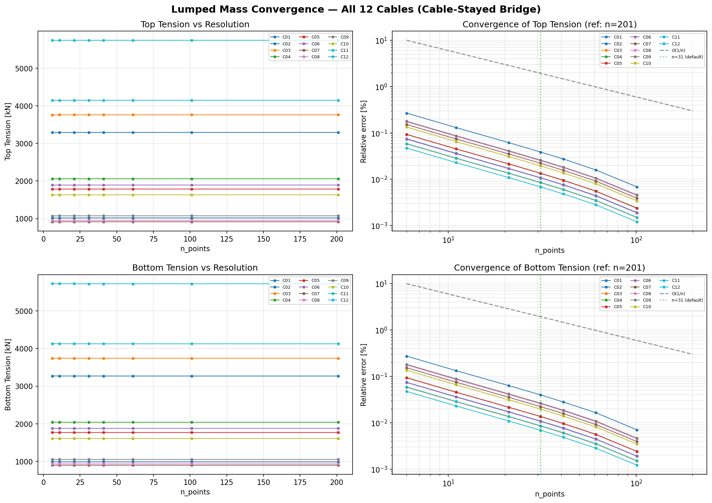

# cable — Cable / mooring line dynamics solver

質点ばねモデルによるケーブル動力学 C++ ソルバと，その入出力を包む Python GUI
一式．BEM 本体 ([lib/include/Network.hpp](../lib/include/Network.hpp),
[lib/include/LumpedCable.hpp](../lib/include/LumpedCable.hpp)) の派生クラスとして
実装され，共有メッシュ/積分インフラを流用する．

## 目的

- **浮体式海洋構造物の係留索解析** — 大変形カテナリ，touchdown，張力評価．
  ISO19901-7 (2013) 相当の諸元（R4 チェーン 132 mm, 1.4 GN 剛性 等）を初期
  想定．複数本の係留索を 1 つの `LumpedCableSystem` で一括管理する．
- **斜張橋ケーブル解析への流用** — 橋梁ケーブルの独立平衡形状．複数本を
  まとめて 1 回の CLI 呼び出しで解ける（多重ライン入力）．**バフェッティング
  (準定常)** は 2026-04 以降，fluid=air + 一様風 / AR(1) 乱流で扱える．
  VIV ロックインとギャロッピングは未対応 ([TODO](#todo) 参照)．
- **BEM 時間領域ソルバ側との接続** — `LumpedCable` は `Network` 派生なので，
  同じ RK4 時間積分インフラで浮体 BEM と連成する．`CableAttachment::BodyFrame`
  で端点を浮体フレームに追従させ，`LumpedCableSystem::advanceRKStage` /
  `commitRKStep` を BEM 側時間ループから呼び出す構成．

## 実装内容

### クラス階層

2026-04-12 のリファクタで次の構成に落ち着いた．すべて
[lib/include/LumpedCable.hpp](../lib/include/LumpedCable.hpp) に集約．

| 型 | 役割 |
|---|---|
| `LumpedCable` | 1 本の集中質量ケーブル（旧 `MooringLine` の後継）．`Network` 派生 |
| `CableProperties` | POD: `mass_per_length`, `EA`, `damping`, `diameter`, `EI=0`（将来用） |
| `CableAttachment` | 端点の拘束種別 `{WorldFixed, BodyFrame}` + オフセット．浮体追従時は `Network* body` と world/body pose から端点位置を計算 |
| `LumpedCableSystem` | 複数の `LumpedCable` を束ねる．`addCable()`, `solveEquilibrium()`, `advanceRKStage()/commitRKStep()`, `forceOnBody()` |

`using MooringLine = LumpedCable;` のエイリアスが同ヘッダ末尾で提供されて
いるので，旧 `MooringLine` を参照する古いコードは変更なしで通る．

### ディレクトリ構成

| パス | 内容 |
|---|---|
| [cable_solver.cpp](cable_solver.cpp) | メイン CLI ソルバ．単一ライン・多重ライン両方の JSON を受け付ける |
| [build_solver/](build_solver/) | `cable_solver` バイナリのビルドツリー |
| [gui/](gui/) | PySide6 + PyVista 製 GUI (`pycable` パッケージ) |
| [gui/examples/](gui/examples/) | 公開入力例セット (synthetic + 公開文献 8 ケース)．詳細は [gui/examples/README.md](gui/examples/README.md) 参照 |
| [gui/examples/synthetic/](gui/examples/synthetic/) | ソルバ/GUI の smoke-test 用 synthetic 入力例 |
| [memo.md](memo.md) | ISO19901-7 係留諸元，橋梁ケーブル風応答への拡張検討メモ |
| [references/](references/) | 文献資料 |

### ビルド

ルート CMakeLists からトップダウンで作る．

```bash
cd cable/build_solver
cmake -DCMAKE_BUILD_TYPE=Release -DSOURCE_FILE=cable/cable_solver.cpp ../..
make -j$(sysctl -n hw.logicalcpu)
```

生成物は [build_solver/cable_solver](build_solver/cable_solver)．
GUI の `solver_discovery.py` はこのパスを自動検出する．

### CLI

```bash
./cable_solver input.json output_dir/
```

入力 JSON のフォーマットを自動判定して処理する．検出順:

1. `input_files` キーあり → **settings mode**（複数ケーブルファイルを参照）
2. `end_a_position` キーあり → **per-cable format**（新しい標準形式）
3. `mooring_*` / `cable_*` 13 要素配列あり → **多重ライン形式**（BEM 互換）
4. `point_a` キーあり → **単一ライン形式**（レガシー）

#### 出力先

結果は `output_dir/` に書かれる:

| 形式 | 出力ファイル |
|---|---|
| per-cable | `output_dir/<name>_result.json` |
| settings mode | `output_dir/<name>_result.json` （各ケーブルごと） |
| 多重ライン | `output_dir/result.json`（全ケーブルをまとめた 1 ファイル） |
| 単一ライン | `output_dir/result.json` |

GUI 経由の場合，結果は `~/.cache/pycable/runs/<timestamp>/` に自動保存される（`File → Set output directory` で変更可）．`input.json` も同ディレクトリにコピーされるため，History から完全に復元できる．

#### SNAPSHOT

実行中は stdout に SNAPSHOT 行が流れる（GUI がリアルタイム 3D 更新に使用）．

- 単一 / per-cable: `SNAPSHOT {"iter":N,"norm_v":...,"positions":[...]}`
- 多重ライン: `SNAPSHOT {"iter":N,"cable":"L01","norm_v":...,"positions":[...]}`
- 動的モード: `SNAPSHOT {"t":0.01,"iter":N,"positions":[...]}`

### 入力 JSON schema

ソルバは 4 種類の入力形式を自動判別する．通常は **per-cable 形式**
（1 ケーブル = 1 JSON）か，複数ケーブルを束ねる **settings.json 形式**を使う．
キー一覧，風設定，レガシー形式，BEM 互換形式の詳細は
[docs/input_json_schema.md](docs/input_json_schema.md) に分離した．

| 形式 | 判定キー | 用途 |
|---|---|---|
| settings mode | `input_files` | 複数 per-cable JSON + 共通スカラー |
| per-cable format | `end_a_position` | 単一ケーブルの自己完結 JSON |
| 多重ライン形式 | `mooring_<name>` / `cable_<name>` | BEM 互換の 13 要素配列 |
| 単一ライン形式 | `point_a` | レガシーのフラット入力 |

最小の per-cable 入力例:

```json
{
  "name": "C01",
  "end_a_position": [-104.1, 0.0, 0.0],
  "end_b_position": [0.0, 0.0, 45.0],
  "end_a_body": "deck",
  "end_b_body": "tower",
  "initial_condition": "tension",
  "tension_top": 1019998,
  "tension_bottom": 986767,
  "cable_length": 113.41,
  "n_points": 31,
  "line_density": 63.2514,
  "EA": 1530925000.0,
  "damping": 0.5,
  "diameter": 0.10129,
  "output_directory": "./output",
  "gravity": 9.81,
  "mode": "equilibrium"
}
```

複数ケーブルは `settings.json` で束ねる:

```json
{
  "input_files": ["cables/C01.json", "cables/C02.json", "cables/C12.json"],
  "output_directory": "./output",
  "gravity": 9.81,
  "mode": "equilibrium",
  "max_equilibrium_steps": 500000,
  "equilibrium_tol": 0.01,
  "snapshot_interval": 5000
}
```

`input_files` の各パスは `settings.json` からの相対パスで解決される．
settings の共通パラメータは各ケーブル JSON のデフォルトとして適用され，
ケーブル側に同キーがあればそちらが優先される．

### 出力 `result.json`

#### 単一ライン形式

| Key | Type | 意味 |
|---|---|---|
| `n_nodes` | int | 節点数 |
| `positions` | `[[x,y,z], ...]` | 最終節点座標 |
| `tensions` | `[T_0, ..., T_{n-1}]` | 節点張力（隣接 2 セグメントの平均） |
| `top_tension` | float | 末尾セグメントの張力 |
| `bottom_tension` | float | 先頭セグメントの張力 |
| `max_tension` | float | 全セグメント張力の最大値 |
| `converged` | bool | 収束時 `true`，`max_equilibrium_steps` 到達で `false` |
| `computation_time_ms` | float | ソルバ経過時間 |

#### 多重ライン形式

```json
{
  "n_cables": 3,
  "converged": true,
  "computation_time_ms": 524.0,
  "cables": {
    "L01": { "n_nodes": 41, "positions": [...], "tensions": [...],
             "top_tension": ..., "bottom_tension": ..., "max_tension": ... },
    "L02": { ... },
    "L03": { ... }
  }
}
```

各ケーブル名をキーとする辞書の中に，単一ライン形式と同じフィールドが入る．

### 例題

全ての公開例は [gui/examples/](gui/examples/) 配下．詳細索引は
[gui/examples/README.md](gui/examples/README.md)．

#### Synthetic (smoke-test)

| 例題 | 場所 | 形式 | 内容 |
|---|---|---|---|
| 標準カテナリ 522 m | [synthetic/catenary_500m.json](gui/examples/synthetic/catenary_500m.json) | 単一 | ISO19901-7 相当チェーン，深さ 58 m |
| 橋梁ケーブル小例 | [synthetic/bridge_cable_small.json](gui/examples/synthetic/bridge_cable_small.json) | 単一 | GUI 用の軽量テスト |
| 3 本脚カテナリ係留 | [synthetic/mooring_3leg_catenary.json](gui/examples/synthetic/mooring_3leg_catenary.json) | 多重 | 120° 分散の 3 本脚 |
| 端点 heave 振動 | [synthetic/dynamic_heave.json](gui/examples/synthetic/dynamic_heave.json) | per-cable | 動的モード，片端 sinusoidal |
| 橋梁 C01 単独 | [bridge_C01.json](gui/examples/bridge_C01.json) | per-cable | 斜張橋 1 本，回帰用 seed |

#### 公開文献ベンチマーク (8 ケース，fluid=air 明示)

| Directory | 事例 | 主対象 | 入力データ状況 |
|---|---|---|---|
| [fred_hartman_1995/](gui/examples/fred_hartman_1995/) | Fred Hartman (TX, USA) | RWIV 古典事例 / viscous damper retrofit | ★ `published_table15/` の 12 本が実データ (FHWA-HRT-05-083 Table 15)，`cables_placeholder/` は smoke-test 用 |
| [sutong_2008/](gui/examples/sutong_2008/) | Sutong (苏通, China) | 多モード VIV / VSD | ★ Chen 2020 Table 1 実データ |
| [stonecutters_2009/](gui/examples/stonecutters_2009/) | Stonecutters (HK) | 長期 SHM / 温度依存 | `cables_placeholder/` のみ (Ni 2010+ WASHMS データ論文未取得) |
| [dongting_lake_2007/](gui/examples/dongting_lake_2007/) | Dongting Lake (China) | RWIV 現場長期観測 | inferred (Ni 2007) |
| [stavanger_city_2021/](gui/examples/stavanger_city_2021/) | Stavanger City (Norway) | 乾湿比較 (OA) | inferred (Daniotti 2021) |
| [east_china_sea_viv_2019/](gui/examples/east_china_sea_viv_2019/) | East China Sea (China) | 多モード VIV (OA) | inferred (Chen 2019) |
| [nrc_rwiv_2023/](gui/examples/nrc_rwiv_2023/) | NRC Canada 大型試験 | 制御 RWIV (OA) | D'Auteuil 2023 諸元 |
| [fhwa_dry_inclined_2007/](gui/examples/fhwa_dry_inclined_2007/) | FHWA dry inclined test | Scruton 数実験 | FHWA-HRT-05-083 |

#### 計算結果スナップショット

計算結果から作った代表図は [docs/calculation_snapshots/](docs/calculation_snapshots/) に置いている．

| 図 | 内容 |
|---|---|
| [sutong_2008_pos_neg_neutral_x10.svg](docs/calculation_snapshots/sutong_2008_pos_neg_neutral_x10.svg) | 揺れが見える Sutong 3 本．黒点線 = 中立/静的，赤 = 正側，青 = 負側，変位のみ 10 倍 |
| [fred_hartman_table15_published_properties.svg](docs/calculation_snapshots/fred_hartman_table15_published_properties.svg) | FHWA Table 15 の published 12 stays の長さ・張力・質量・周波数 |
| [fred_hartman_table15_12stays_small_multiples.svg](docs/calculation_snapshots/fred_hartman_table15_12stays_small_multiples.svg) | 12 本を別パネルで表示した published-properties 図 |
| [fred_hartman_table15_tension_error.svg](docs/calculation_snapshots/fred_hartman_table15_tension_error.svg) | published tension と solver equilibrium `T_top` の誤差 |
| [fred_hartman_table15_frequency_consistency.svg](docs/calculation_snapshots/fred_hartman_table15_frequency_consistency.svg) | published frequency と `f=(1/2L)sqrt(T/m)` の整合 |

Fred Hartman の 12 本図は，ネットで再確認した FHWA-HRT-05-083 Table 15 の
published properties 検証図であり，実橋端点座標図ではない．Table 15 は
13S-24S の質量・張力・長さ・周波数を載せるが，端点座標は載せていない．
同レポート Figure 126 の AS1-AS12 等価 2D モデルは別系列なので，Table 15
の 13S-24S には混ぜない．

## モデル方法

### データ構造

`LumpedCable` は `Network` の派生クラス
([LumpedCable.hpp](../lib/include/LumpedCable.hpp))．生成時に端点 A, B の間を
等分割して `networkPoint` と `networkLine` を張り，
`total_length / n_segments` を各 `networkLine::natural_length` に設定する．

`setDensityStiffnessDampingDiameter(double mass_per_length, ...)` で
`weight_per_unit_length`, `stiffness`, `damping`, `diameter` を全 line に設定し，
各節点の質量を $m_i = \tfrac12(L_{i-1}+L_i)\,\rho_\text{line}$ として算出する．
先頭・末尾節点の質量は半分になる．

> Note: メンバ名 `weight_per_unit_length` は歴史的経緯で「重量」と名乗るが，
> 実態は**単位長あたり質量** [kg/m] である．2026-04-12 のリファクタで引数名
> は `density` → `mass_per_length` に統一した．メンバ名の統一は後日．

### 節点力（[Network.hpp](../lib/include/Network.hpp)）

1. **張力 `getTension()`**
   - 弾性項（引張のみ）:
     $\vec F_\text{el} = EA \cdot \max(0, \varepsilon) \cdot \hat{\Delta x}$,
     $\varepsilon = (|\Delta x| - L_0)/L_0$
   - 隣接節点間の相対速度に対する粘性項:
     $\vec F_\text{damp} = -c_l \, (\vec v_i - \vec v_j)$
     ($c_l$ は `networkLine::damping`，材料粘性として働く)
   - 圧縮時 ($\varepsilon < 0$) は弾性項ゼロ，粘性項のみ残る．

2. **抗力 `getDragForce(Cd, rho, U_fluid)`**
   - 流体密度 `rho` と流体速度 `U_fluid` が引数化済み（2026-04-15）．
     settings.json の `"fluid"` プリセット（`water` | `air`）で既定値を選択，
     `"fluid_density"` / `"drag_Cd"` で個別上書き可能．
   - 節点の相対速度 $\vec v_\text{rel} = \vec U_\text{fluid} - \vec v_\text{node}$
     の接線垂直成分から
     $\vec F_d = \tfrac12 \rho |v_{\text{rel},\perp}|^2 \, C_d \, A_\text{proj} \, \hat v_{\text{rel},\perp}$
     を計算する．

   **風の入力** — `LumpedCable::wind_field` を `std::function<Tddd(const Tddd&, double)>`
   で差し込む．`cable_solver.cpp` は settings.json の `"wind_type"` に応じて:
   - `"none"`: 無風（既定）
   - `"uniform"`: 時刻・位置によらず一定 $\vec U_\text{mean}$
   - `"AR1"`: Ornstein-Uhlenbeck 乱流 $d\vec x/dt = -\vec x/T_L + \sigma_u\sqrt{2/T_L}\,\vec\eta(t)$，
     $\sigma_u = \text{TI}\cdot|\vec U_\text{mean}|$．全節点で同値を返す（空間相関なし）．

   **平衡計算時の扱い** — `solveEquilibrium()` は `DragForceCoefficientGuard` で
   一時的に $C_d=1000$，`FluidDensityGuard` で $\rho=\rho_\text{water}$ に差し替えて
   擬似緩和するが，風が設定されている (`wind_field != nullptr`) 場合はこの
   トリックを無効化し，ユーザー設定のまま緩和する（風下の物理的平衡を得るため）．
   動的モードの初回平衡は風抑制で疑似緩和（カテナリー IC）して，時間ループで風を再活性化．

   **加速収束** — 擬似緩和には二次抗力 $\propto |v|^2$ しか効かず，$|v|$ が小さくなると
   減衰も小さくなって $1/t$ 型の遅い収束になる．これを補うため，`AlphaMGuard` で
   Rayleigh 質量比例減衰 $\alpha_M \cdot m \cdot \vec v$ を追加する
   （$\alpha_M = 2\omega_\text{pendulum} = 2\sqrt{g/L}$，最低周波の振り子モードを臨界減衰）．
   これにより収束が指数的になり，橋梁ケーブル等で反復数が数倍減る
   （2026-04-15 導入）．動的モードでは $\alpha_M=0$ なので物理的影響なし．

3. **重力** — $\vec F_g = m_i \, g \, (0,0,-1)$．

### 時間積分

#### `LumpedCable::step(t, dt, BC)` — 純粋な RK4 1 ステップ

dt ランプや stdout 出力を持たない薄い 1 ステップ進行関数．BEM 時間ループ
(`LumpedCableSystem::advanceRKStage`) から RK ステージ毎に呼ばれる．

#### `LumpedCable::simulate(t, dt, BC, silent=false)` — warmup 付き

step 数に応じた dt ランプ（最初の 10/100/1000 ステップを細かくする）を
持つ．旧 `MooringLine::simulate` と完全互換．`silent=true` で stdout を
抑制できる．

#### `LumpedCable::setEquilibriumState(BC, tol=1e-3, max_iters=100)`

`DragForceCoefficient` を RAII guard で一時的に 1000 まで持ち上げ，
`simulate` をループ呼び出しして静的平衡を探索する．収束判定
`norm_total_velocity < tol` が効いており（以前はコメントアウトされていた），
収束したら `true` を返して早期終了する．

#### `LumpedCableSystem::solveEquilibrium(tol, max_steps, snapshot_interval, snapshot_cb)`

`cable_solver.cpp` が旧来持っていた自前の RK4 疑似緩和ドライバを System 側
に移植したもの．特徴:

- **ケーブルごとの CFL dt**: 各ケーブルの
  $\Delta t_\text{cfl} = L_0 / \sqrt{EA/\rho_\text{line}}$ を個別に保持し，
  それぞれの固有タイムスケールで進める．
- **ケーブルごとの収束ロック**: 1 本ずつ `max|v| < tol && step > 1000` を
  満たした時点でそのケーブルの積分を停止する．全本ロックで外側ループ終了．
  これにより 12 本混在系でも，個別に解いた結果と数値誤差レベル（< 0.005 N）
  で一致する．
- **snapshot コールバック**: `(iter, max_vel, positions_by_name)` を
  `snapshot_interval` ごとに呼ぶ．pycable の live 3D 更新のインタフェース．
- **Cd = 1000 の RAII guard**: 例外で途中終了しても元の抗力係数に戻る．

#### `LumpedCableSystem::advanceRKStage(t, dt) / commitRKStep()`

BEM 時間ループの各 RK ステージごとに呼ぶ 2 段階 API．
`advanceRKStage` は各 `CableAttachment` から現 RK 段での fairlead 位置を
`currentWorldPosition()` / `nextWorldPosition(dt)` で取得し，各 cable に対し
`step(t, dt, BC)` を 1 回呼ぶ．`commitRKStep` は `net->RK_Q.finished` が
true のときに `p->X`, `p->velocity` へ RK サブ状態を反映する．

`CableAttachment::nextWorldPosition(dt)` は旧 `nextPositionOnBody()` の
3 分岐（SoftBody / `relative_velocity` / RigidBody + `isFixed` 軸別固定）を
そのまま移植しているので，BEM 既存挙動と完全一致する．

#### `LumpedCableSystem::forceOnBody(body) → (F, T)`

指定 `body` に `BodyFrame` で取り付いた全ケーブルの fairlead 合力・合モー
メントを返す．`end_a` / `end_b` どちらでも対応できる対称実装．BEM
[bem/core/BEM_solveBVP.hpp](../bem/core/BEM_solveBVP.hpp) の力フィードバック
に使う．

### 現在の物理モデルの制約

- 曲げ剛性 $EI$ なし（純粋な string モデル）．将来用のフィールド
  `CableProperties::EI = 0` だけ先行で置いてある．橋梁ケーブルの端部応力・
  疲労評価には不十分．
- 空力モデルは **quasi-steady drag のみ**．VIV ロックイン，ギャロッピング，
  レイン・ウィンド振動は未実装（Level 0.5 相当まで）．
- 風速場は **一様 + AR(1) 乱流** のみ．Davenport/von Kármán スペクトルや
  空間相関 (コヒーレンス関数) は未実装．
- 構造減衰は隣接節点間相対速度（材料粘性）のみ．Rayleigh 質量比例項は
  平衡緩和時の擬似項として `AlphaMGuard` で付加（動的モードでは無効）．
- 動的モード (`mode: "dynamic"`) の端点励振は **sinusoidal / cantilever
  (1 + 2 次モード合成)**．時系列ファイル入力は未実装．
- ダンパーは networkLine 単位の線形粘性のみ．HDR，MR，shear-type，
  温度依存係数は未実装 (将来拡張予定，[gui/examples/README.md](gui/examples/README.md) 参照)．

## GUI について

`pycable` — PySide6 + PyVista 製の薄い GUI．物理は一切持たず，`cable_solver`
バイナリを叩くフロントエンドに徹する．詳細は [gui/README.md](gui/README.md)．

*斜張橋の複数ケーブルを settings.json から一括ロード → Run All で
個別に解いた結果を 3D view で確認できる．全ケーブルの張力を共通の
カラースケール（viridis / coolwarm 選択可）で表示，contour 設定は
タイムプレーヤーの [Contour] ボタンから colormap / 範囲を調整．*

### データモデル

- `CableParams` — 単一ケーブルのレガシー入力形式
- `CableSpec` — BEM 互換フラット配列形式（13 要素）
- `LumpedCableSystemParams` — 複数ケーブル + 共通スカラ．settings.json / per-cable / 多重ライン / 単一ラインの全形式を自動判定して読み込み
- `PerCableParams` — 新 per-cable JSON 形式．`initial_condition`, `tension_top/bottom`, `end_a_body/end_b_body`, `end_a_motion/end_b_motion` を含む

### 機能

1. **File → Open input JSON** で全形式を受け付け（settings.json, per-cable, 多重ライン, 単一ライン）．settings.json を開くと参照先の全ケーブルがロードされる
2. **Lines list** でロードされたケーブル一覧を表示，選択中の 1 本を下段フォームで編集
3. **Initial condition** ドロップダウン: `length`（自然長直接指定）/ `tension`（目標張力から逆算）の切替．tension 選択時は Tension top / Tension bottom フィールドが活性化
4. **Run ボタン** — 選択中 1 本を解く
5. **Run All ボタン** — 全ケーブルを一括実行．結果は共通テンションカラーマップで 3D 表示（全ケーブルの張力範囲を統一したスケールバー付き）
6. **File → Set output directory** で結果の永続保存先を指定．未指定時は `~/.cache/pycable/runs/<timestamp>/` に自動保存
7. **File → Recent files** — 最近開いた 10 ファイルを記憶（QSettings 永続化）
8. **History タブ**（下部ドック）— 過去の実行結果を記録．ケース名・張力・時刻を表示．ホバーで詳細（パス，収束状態，計算時間）．**Load ボタン**で結果を再表示 + 入力パラメータを復元（同ディレクトリの `input.json` から完全復元）

### 場所とソルバ探索

- **Dev tree**: [cpp/cable/gui/](gui/) ← 真実の源泉．ここを編集する．
- **Public tree**: `~/CableDynamics/cable/gui/` は dev から
  [sync_all_public.sh](../sync_all_public.sh) で一方向 rsync．直接編集しない．
- `solver_discovery.py` の探索順:
  1. `$PYCABLE_SOLVER_PATH`（環境変数で強制指定）
  2. `$CABLE_DYNAMICS_ROOT/build/cable_solver`
  3. `<cable>/build_solver/cable_solver` (dev レイアウト)
  4. `<cable>/../build/cable_solver` (public レイアウト)
  5. `~/CableDynamics/build/cable_solver`
  6. `which cable_solver`

### 起動

```bash
cd gui
./run.sh
```

初回は `.venv` を作成して `pip install -e .` を走らせ，2 回目以降は同じ
venv を再利用する．

### パッケージ pin

| パッケージ | 制約 | 理由 |
|---|---|---|
| PySide6 | `<6.10` | 6.10.x は `QSplashScreen.show()` ハング・`eventFilter` 再帰 |
| vtk | `==9.3.1` | 9.6+ は Python 3.12 on macOS で import ハング |
| PyVista | `0.43.x` | VTK 9.3.1 と互換 |

### テスト

```bash
cd gui && source .venv/bin/activate
pytest tests/ -v
```

- [tests/test_params.py](gui/tests/test_params.py) — `CableParams` シリアライズ
- [tests/test_system_params.py](gui/tests/test_system_params.py) — `LumpedCableSystemParams` の単一・多重・per-cable・settings 往復
- [tests/test_per_cable_params.py](gui/tests/test_per_cable_params.py) — `PerCableParams` round-trip，legacy 変換
- [tests/test_bridge.py](gui/tests/test_bridge.py) — subprocess ブリッジ層
- [tests/test_solver_discovery.py](gui/tests/test_solver_discovery.py) — バイナリ探索
- [tests/test_integration.py](gui/tests/test_integration.py) — 実バイナリ必須
- [tests/test_bridge_lifecycle.py](gui/tests/test_bridge_lifecycle.py) — 実バイナリ必須

## BEM との連成

BEM 時間領域ソルバ ([bem/time_domain/main_time_domain.cpp](../bem/time_domain/main_time_domain.cpp))
は `Network::cable_system` (`std::unique_ptr<LumpedCableSystem>`) を介して
係留索を扱う．要点:

1. 入力 JSON の `mooring_*` キーを
   [bem/core/BEM_inputfile_reader.hpp](../bem/core/BEM_inputfile_reader.hpp) が
   `cable_system->addCable()` に渡す．端点 A は `CableAttachment::worldFixed`，
   端点 B は `CableAttachment::onBody(floating_body, X_end)`．
2. 全ライン入力が済んだ後，`cable_system->solveEquilibrium()` で初期静的
   平衡を求める．これは `cable_solver` と同じ疑似緩和ドライバ．
3. 時間ループ内では BEM の各 RK ステージで
   `cable_system->advanceRKStage(t, dt)` を呼び，`RK_Q.finished` で
   `commitRKStep()` する．
4. 浮体力の BVP では `cable_system->forceOnBody(body)` が合力・合モー
   メントを返し，並進・回転 BIE に足される．

この構成により，`cable_solver` での橋梁ケーブル静的平衡計算と，BEM 内部の
浮体係留時間積分が**同じコード**を共有する．

## 収束性

節点数（`n_points`）を変えて端点張力の収束を確認した結果（斜張橋 C01–C12，全 12 本）:



- 右側の log-log グラフの「Relative error」は，**n=201（最精密離散化）の結果を参照値**として計算した相対誤差であり，解析解や実測値との比較ではない
- つまりこのグラフは「Lumped Mass モデルの**離散化誤差の収束傾向**」を示すものであり，「物理的に正しい値への収束」を保証するものではない
- 全ケーブルが O(1/n) の 1 次収束を示す（Lumped Mass の線形要素として妥当）
- n=31（デフォルト設定）で離散化誤差 < 0.04%
- 物理的な妥当性の検証は，別途 FEM 参照値との比較（12 本斜張橋例題で最大 RMS 0.56%）および公開文献ベンチマークでの静的張力再現（[gui/examples/README.md](gui/examples/README.md) 参照，Sutong Chen 2020 で ±1.5%）で確認済み

## 並列化

settings.json の複数ケーブルを OpenMP で並列化（2026-04-15 導入）:

- [cable_solver.cpp:1184](cable_solver.cpp#L1184) 平衡モード
- [cable_solver.cpp:1237](cable_solver.cpp#L1237) 動的モード（body 駆動）

各 `solvePerCable` 呼び出しは独立な `LumpedCableSystem` を作るので，RK4 状態・結果ファイル・per-cable PVD は完全に分離．唯一の共有状態は:

- **`master_pvd`** （動的モードの全ケーブル統合 PVD）: `_Pragma("omp critical(master_pvd)")` で `push` / `output` を直列化（[cable_solver.cpp:917-927](cable_solver.cpp#L917-L927)）
- **`cable_part`** (PVD の dataset index): 逐次インクリメントから **ループ index `idx` 由来**に変更．race なし
- **グローバル `_GRAVITY_` / `_GRAVITY3_`**: 全ケーブルで同じ値を書くので benign race

### 性能

12 本斜張橋例題 (per-cable 材料，fluid=air) で計測:

| 実行形態 | 壁時間 | CPU 使用率 | 備考 |
|---|---|---|---|
| `OMP_NUM_THREADS=1` | 5.47 s | 97% | 直列実行 |
| デフォルト (10 スレッド) | **1.12 s** | 500% | **4.9× 高速化** |

### 制約

- **単一ケーブル実行ではケーブル並列化は効かない**（OMP_NUM_THREADS の設定にかかわらず同等速度）．1 本の反復数削減には α_M RAII（[solveEquilibrium](../lib/include/LumpedCable.hpp#L703)）等の別最適化が効く．
- **stdout の SNAPSHOT 行がスレッド間で交錯**する．各行は自己完結の JSON（`cable` フィールド付き）なので GUI 側で demux 可能だが，清潔なログが欲しい場合は `OMP_NUM_THREADS=1` に設定．
- **Per-node の並列化は未導入**（典型 N=30–40 ノードでは OMP オーバーヘッドのほうが大きい）．

## 変更履歴

- **2026-04-13**: per-cable JSON 形式（1 ケーブル = 1 ファイル）と settings.json
  を導入．`initial_condition: "tension"` で目標張力から自然長を secant method で
  反復収束する機能を追加（RMS 評価）．動的モード（`mode: "dynamic"`）で端点に
  sinusoidal prescribed motion を指定可能に（CFL sub-stepping 付き）．GUI に
  Run All ボタン（共通テンションカラーマップ），Recent Files メニュー，Run History
  （永続化 + Load 復元），output directory 設定，初期条件 UI を追加．
  `cable_common/` 共有パッケージを作成し BEM GUI との共通化基盤を整備．
  12 本斜張橋例題を per-cable + tension 初期条件で検証（FEM 参照値と
  最大 RMS 0.56% で一致）．
- **2026-04-12**: `MooringLine` → `LumpedCable` にリネーム（旧名は
  `using` エイリアスで後方互換維持）．`LumpedCableSystem` + `CableAttachment`
  + `CableProperties` を導入し，cable_solver と BEM 時間ループの両方を
  System ベースに移行．多重ライン入力 / 出力スキーマ追加．pycable GUI に
  Lines list と Run-full-system を追加．

## TODO

### ソルバ機能拡張

- [x] **動的モード (`mode: "dynamic"`) の実装**．sinusoidal prescribed motion に対応（2026-04-13）．
- [ ] **動的境界条件の拡張**．時系列入力（CSV），モーダル変形，mesh body への接続．
- [x] **空気モードの切替**．`getDragForce()` に `rho` 引数を追加，
  `LumpedCable::FluidDensity` で流体種別（水／空気）を制御．
  settings.json / per-cable JSON 共に `"fluid": "water"|"air"`，
  個別上書きに `"fluid_density"` / `"drag_Cd"` を受け付ける（2026-04-15）．
- [x] **風速場の注入**．一様風 + AR(1) 乱流（Ornstein-Uhlenbeck）を実装．
  settings.json の `"wind_type": "none"|"uniform"|"AR1"` で選択，
  `"wind_U_mean"`, `"wind_turbulence_intensity"`, `"wind_integral_time_scale"`,
  `"wind_seed"` で制御（2026-04-15）．発展形（Davenport/von Kármán スペクトル，
  空間相関，高度プロファイル）は未実装．
- [ ] **準定常空力モデル**．独立性原理で $C_D(\alpha), C_L(\alpha)$ を
  断面形状ごとに差し替え可能にする．ギャロッピングの Den Hartog 条件
  $(\partial C_L/\partial\alpha)|_{\alpha_0} + C_D(\alpha_0) < 0$ を判定する
  診断出力も欲しい．検討メモは [memo.md](memo.md) L205–L266 参照．
- [ ] **曲げ剛性 $EI$ と回転拘束**．`CableProperties::EI` フィールドは
  追加済みだが未使用．純 string モデルから 3 点離散曲げ（または
  co-rotational beam）への拡張．
- [ ] **Rayleigh 構造減衰**．既存の `networkLine::damping` は隣接節点間粘性
  なので，別途節点絶対速度に対する質量比例項 $\alpha \mathbf{M}$ を加える．
- [x] **プリテンション指定モード**．`initial_condition: "tension"` + `tension_top` / `tension_bottom` で secant method 反復（2026-04-13）．

### 橋梁ケーブル検証

- [x] 公開文献 8 ケース (`fred_hartman_1995`, `sutong_2008`, `stonecutters_2009`,
  `dongting_lake_2007`, `stavanger_city_2021`, `east_china_sea_viv_2019`,
  `nrc_rwiv_2023`, `fhwa_dry_inclined_2007`) の整備 (2026-04-16，[gui/examples/README.md](gui/examples/README.md))．
- [x] Sutong Chen 2020 Table 1 から 3 本の実データ JSON 化．入力 target と solver 出力の整合を確認．
- [x] Fred Hartman FHWA-HRT-05-083 Appendix F Table 15 から 12 stays を JSON 化．
  published `mass/T/L/f` の内部整合，equilibrium 12/12 収束，最大 `T_top` 誤差 0.819% を確認．
- [ ] **自由振動テストによる f₁ 直接同定** — solver が論文 f₁ を独立再現できるかの本物検証．
  `initial_condition=tension` は入力 target であり独立検証ではない．
- [ ] FHWA-HRT-05-083 本文 PDF の再取得と Fred Hartman 192 本ケーブル諸元の抽出可否確認．
- [ ] Stonecutters ケーブル諸元付き論文 (Ni 2010+ の WASHMS データ解析) の取得．
- [ ] Scruton 数スイープによる RWIV 抑制閾値 (Sc > 10) の再現 (FHWA データと比較)．
- [ ] `line_density` の単位「kg/m」と線素密度 $\rho A$ の整合ドキュメント．

### 整理

- [x] 重複していた `bridge_12_cables/` を統合整理 (2026-04-16)．
- [ ] 旧バイナリ (`main`, `example_using_Network`, `example_validation1`) と
  未使用 `.cpp` サンプルを `legacy/` へ退避 or 削除．
- [ ] 古い leapfrog 結果 JSON と `sample*.gif` の整理．
- [ ] `weight_per_unit_length` メンバ名を `mass_per_length` に統一（今は
  引数名だけ統一済み）．

---

License: LGPL-3.0-or-later（BEM 本体と同じ）．
