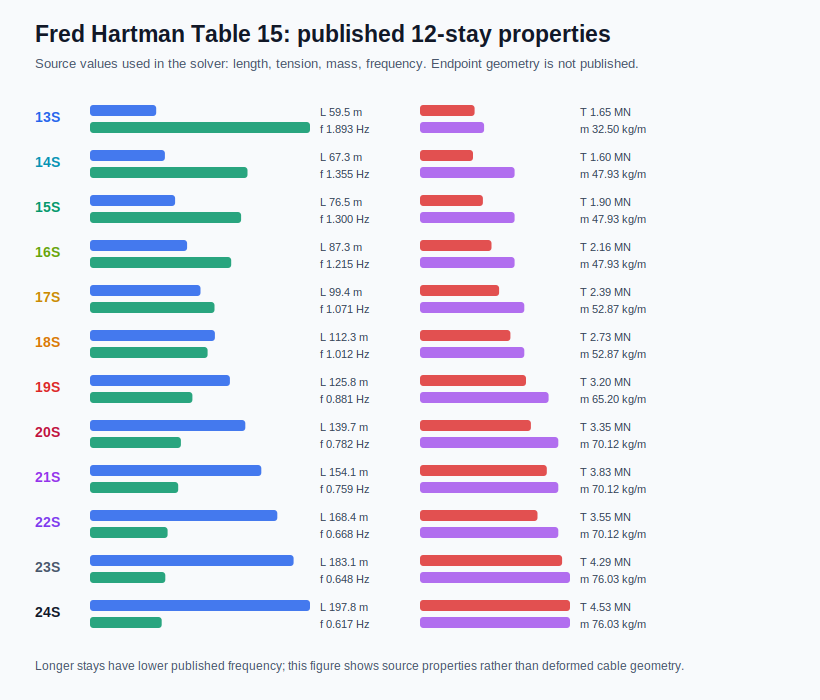
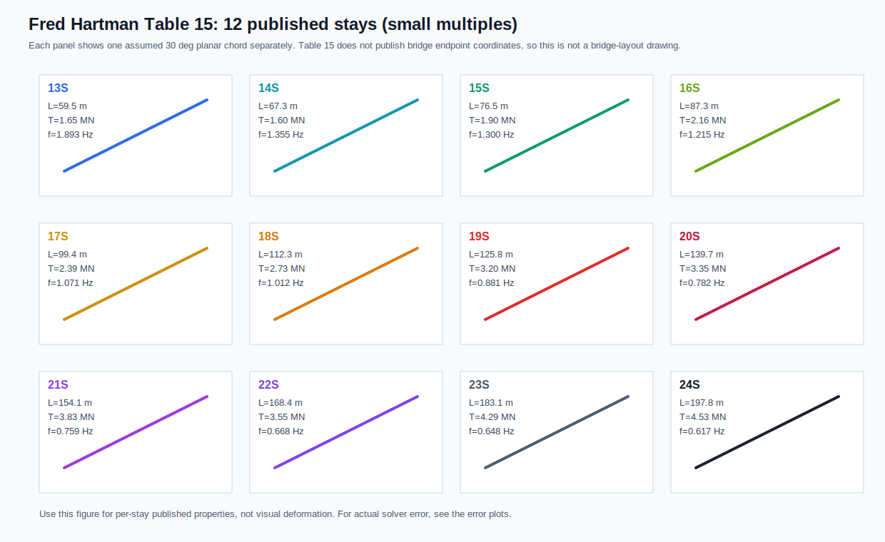
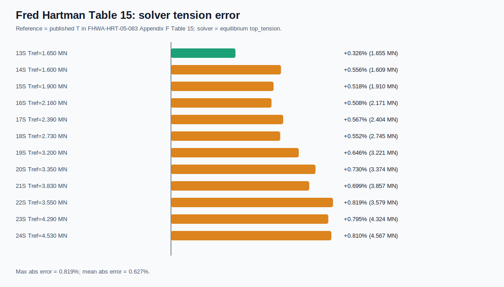
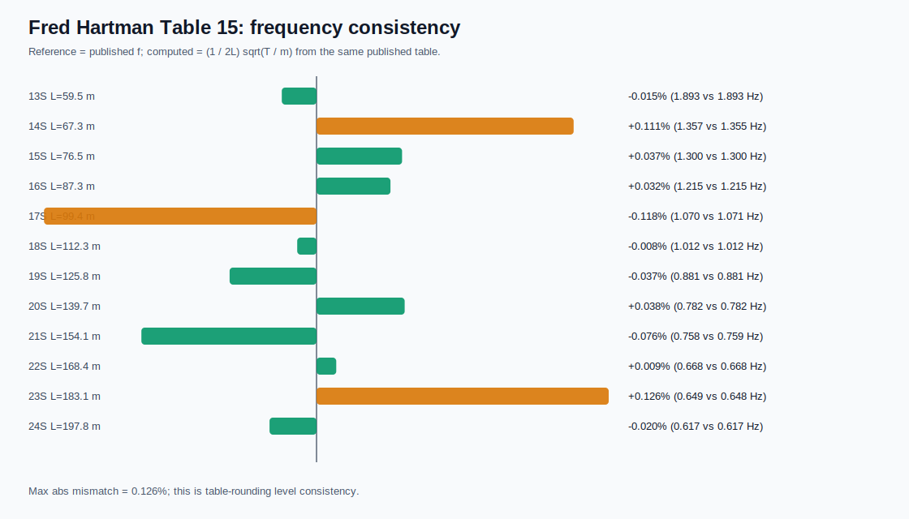

# FHWA-HRT-05-083 Appendix F Table 15 Stays

This directory contains 12 published Fred Hartman Bridge stay-cable records
from FHWA-HRT-05-083 Appendix F, Table 15.

Source:
https://www.fhwa.dot.gov/publications/research/infrastructure/bridge/05083/appendf.cfm

## Published Values

| Stay | Mass [kg/m] | Tension [MN] | Length [m] | omega [rad/s] | f [Hz] |
|---|---:|---:|---:|---:|---:|
| 13S | 32.50 | 1.65 | 59.523 | 11.895 | 1.893 |
| 14S | 47.93 | 1.60 | 67.345 | 8.516 | 1.355 |
| 15S | 47.93 | 1.90 | 76.549 | 8.171 | 1.300 |
| 16S | 47.93 | 2.16 | 87.333 | 7.633 | 1.215 |
| 17S | 52.87 | 2.39 | 99.377 | 6.727 | 1.071 |
| 18S | 52.87 | 2.73 | 112.280 | 6.360 | 1.012 |
| 19S | 65.20 | 3.20 | 125.779 | 5.537 | 0.881 |
| 20S | 70.12 | 3.35 | 139.701 | 4.916 | 0.782 |
| 21S | 70.12 | 3.83 | 154.076 | 4.766 | 0.759 |
| 22S | 70.12 | 3.55 | 168.403 | 4.195 | 0.668 |
| 23S | 76.03 | 4.29 | 183.056 | 4.074 | 0.648 |
| 24S | 76.03 | 4.53 | 197.847 | 3.876 | 0.617 |

## Modeled Values

FHWA Table 15 does not provide endpoint coordinates, cable outer diameter, or
EA. The JSON files therefore use:

- published: mass, tension, length, omega, frequency;
- assumed: planar 30 degree chord geometry;
- inferred: steel-equivalent area from `mass / 7850 kg/m^3`, `EA = 200 GPa * area`,
  and steel-equivalent diameter.

These inputs are suitable for published-value consistency checks and
multi-cable solver smoke tests. They are not a calibrated 3D reproduction of
the Fred Hartman Bridge geometry.

Internet check (2026-04-16): FHWA-HRT-05-083 Figure 117 confirms that Table 15
refers to a 12-stay south-tower central-span system (`13S`-`24S`), but the
published table lists only mass, tension, length, angular frequency, frequency,
and nondimensional ratios. Figure 126 in the same report belongs to a separate
AS1-AS12 A-line side-span equivalent model; it is useful context for crosstie
network behavior, not endpoint coordinates for this Table 15 set.

## Verification

The published frequency is internally consistent with the table's mass,
tension, and length:

`f = (1 / (2 L)) sqrt(T / m)`

The maximum mismatch from the listed frequency is 0.126%, attributable to table
rounding.

Running:

```bash
./build_solver/cable_solver \
  gui/examples/fred_hartman_1995/settings_table15_12stays_equilibrium.json \
  /tmp/cable_verify_fred_hartman_table15_eq

./build_solver/cable_solver \
  gui/examples/fred_hartman_1995/settings_table15_12stays.json \
  /tmp/cable_verify_fred_hartman_table15_dyn
```

gave:

- 12/12 equilibrium cases converged;
- maximum equilibrium `T_top` error against the published tension target: 0.819%;
- 12/12 dynamic cases completed;
- no NaN, Inf, or negative tension values;
- current generic tower excitation gives negligible visible motion for these
  stays, so this is a published-properties validation case rather than the
  clearest animation demo.

## Figures








